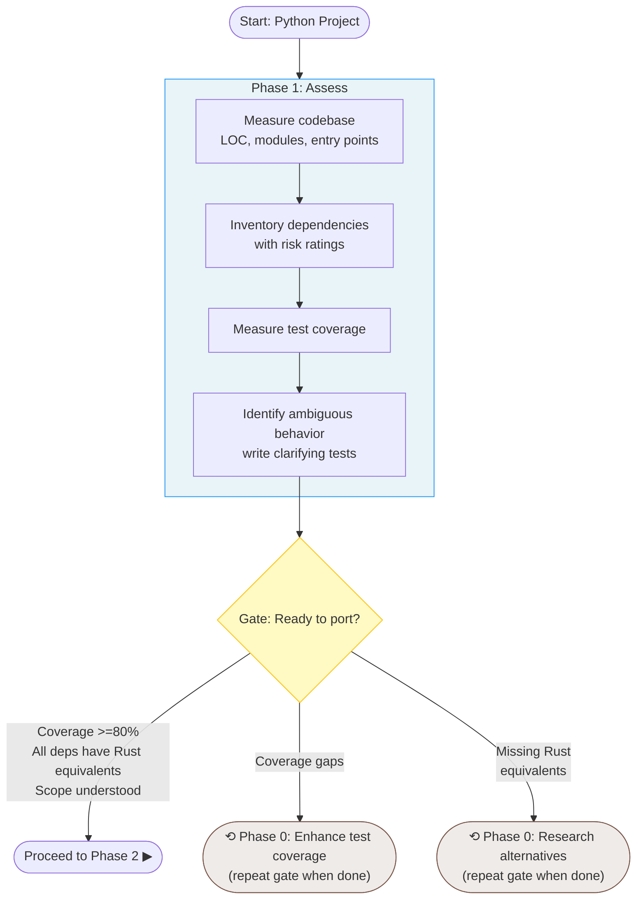
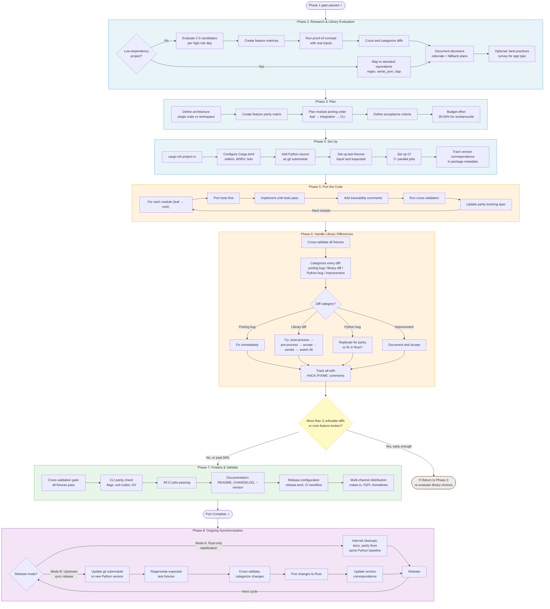
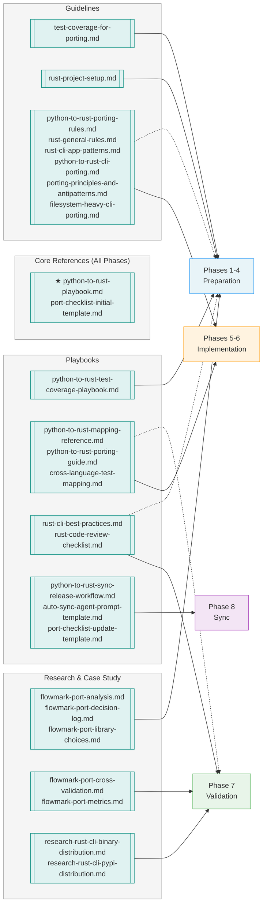
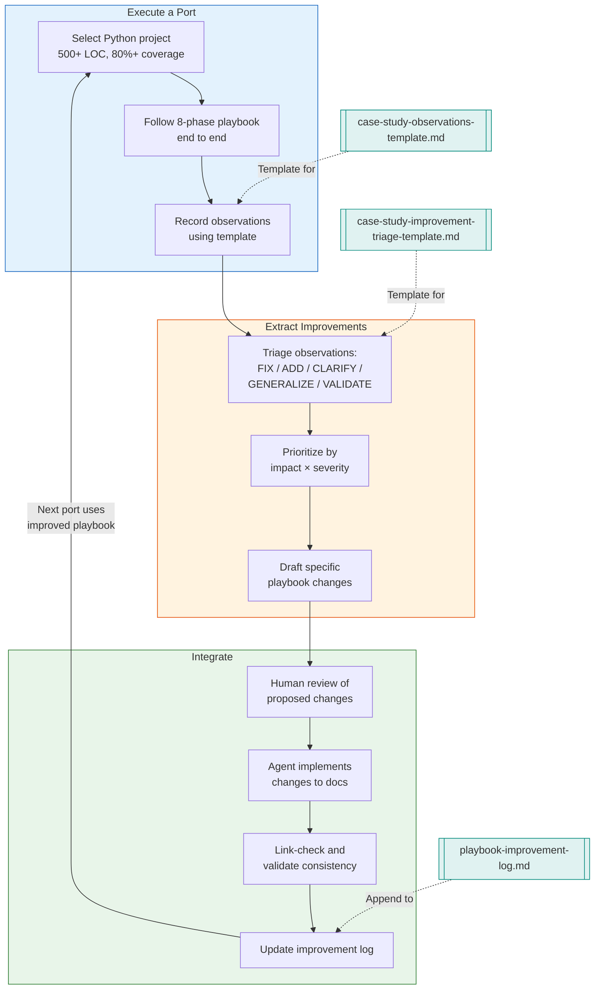
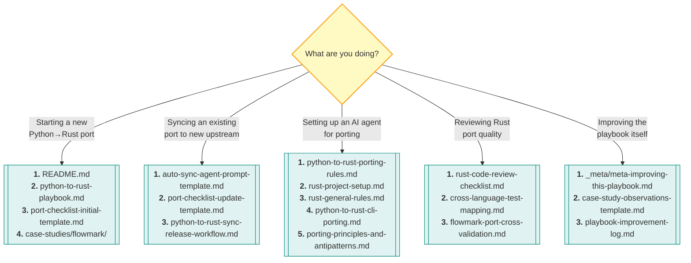
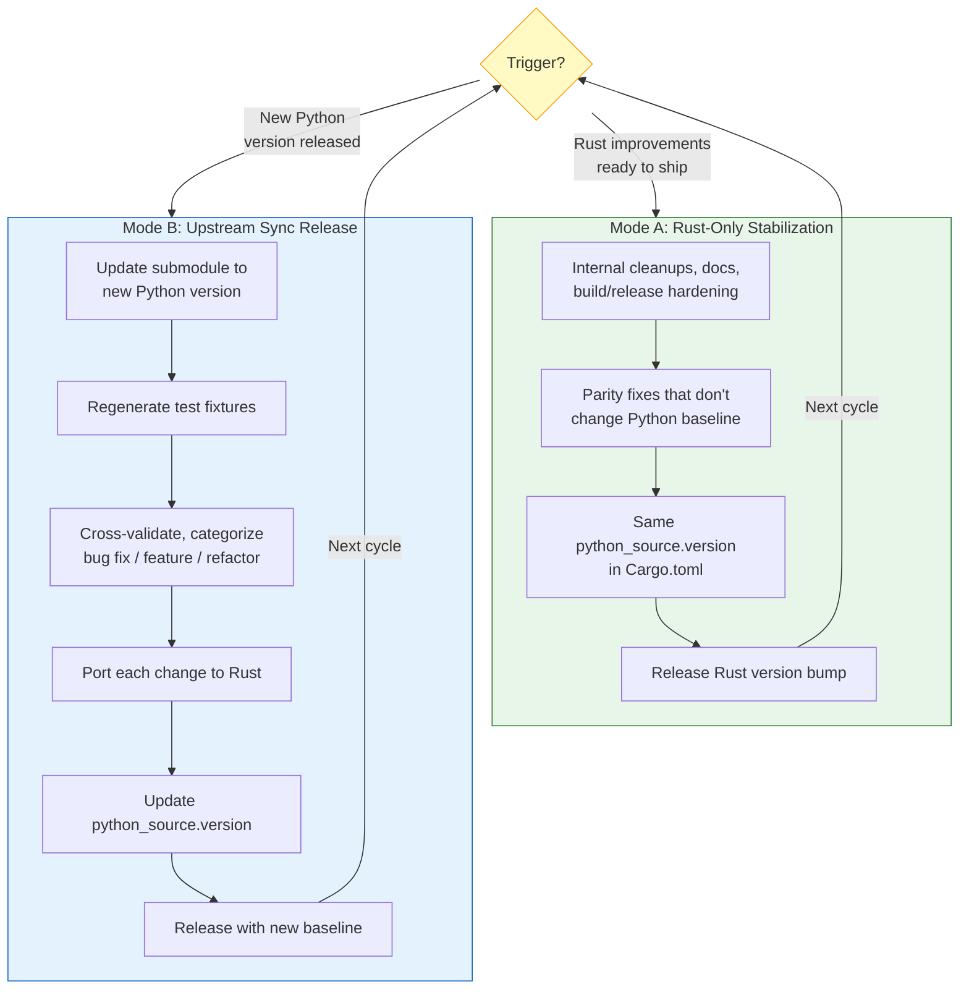

# Playbook Flow Analysis

A visual map of the Rust Porting Playbook's process flow, decision gates, resource
dependencies, and document relationships.

## 1. Process Flow: The 8-Phase Porting Lifecycle

These diagrams show the end-to-end process, including decision gates that block
progression and feedback loops that send you back to earlier phases.

### Preliminaries (Phases 0-1)



### Porting (Phases 2-8)



**Phase color key:**
- Tan (Phase 0 / loop-back nodes): Remediation — repeat gate until conditions met
- Blue (Phases 1-4): Planning and preparation — ~25% of effort
- Orange (Phases 5-6): Implementation and fixing — ~65% of effort
- Green (Phase 7): Validation and release — ~10% of effort
- Purple (Phase 8): Ongoing maintenance

**Decision gates** (yellow diamonds) are blocking — you cannot proceed without
satisfying their conditions.

---

## 2. Resource Dependency Map

This diagram groups the 34 documents by function and maps them to lifecycle
stages. Solid arrows show primary usage; dotted arrows show secondary usage
(only some docs in the group apply). For exact per-document phase mappings,
see the inventory table in Section 8.



---

## 3. Document Relationship Map

This shows how documents reference each other — the internal link structure
of the playbook itself.

```mermaid
flowchart TD
    README[["<b>README.md</b><br/>Entry point"]] --> MAIN
    README --> CHK_INIT
    README --> CHK_UPD
    README --> AUTO_SYNC
    README --> META

    MAIN[["<b>python-to-rust-playbook.md</b><br/>8-phase process"]]
    MAIN --> TEST_COV
    MAIN --> MAPPING
    MAIN --> CLI_BP
    MAIN --> TEST_MAP
    MAIN --> G_SETUP
    MAIN --> G_CLI
    MAIN --> SYNC_WF
    MAIN --> G_FS

    TEST_COV[["python-to-rust-test-coverage-playbook.md"]]
    MAPPING[["python-to-rust-mapping-reference.md"]]
    GUIDE[["python-to-rust-porting-guide.md"]]

    CLI_BP[["rust-cli-best-practices.md"]]
    CLI_BP --> R_BIN
    CLI_BP --> R_PYPI

    TEST_MAP[["cross-language-test-mapping.md"]]
    REVIEW[["rust-code-review-checklist.md"]]

    CHK_INIT[["port-checklist-initial-template.md"]]
    CHK_INIT --> MAIN
    CHK_INIT --> CS_INDEX

    CHK_UPD[["port-checklist-update-template.md"]]
    CHK_UPD --> SYNC_WF

    SYNC_WF[["python-to-rust-sync-release-workflow.md"]]
    AUTO_SYNC[["auto-sync-agent-prompt-template.md"]]
    AUTO_SYNC --> CHK_UPD
    AUTO_SYNC --> SYNC_WF

    G_SETUP[["rust-project-setup.md"]]
    G_CLI[["python-to-rust-cli-porting.md"]]
    G_PORT[["python-to-rust-porting-rules.md"]]
    G_RUST[["rust-general-rules.md"]]
    G_CLI_PAT[["rust-cli-app-patterns.md"]]
    G_TEST[["test-coverage-for-porting.md"]]
    G_PRINC[["porting-principles-and-antipatterns.md"]]
    G_FS[["filesystem-heavy-cli-porting.md"]]

    R_BIN[["research-rust-cli-binary-distribution.md"]]
    R_PYPI[["research-rust-cli-pypi-distribution.md"]]

    CS_INDEX[["<b>case-studies/flowmark/README.md</b>"]]
    CS_INDEX --> CS_ANALYSIS & CS_METRICS & CS_DECISIONS & CS_LIBS & CS_XVAL & CS_COMRAK & CS_WRAP & CS_PLAN

    CS_ANALYSIS[["flowmark-port-analysis.md"]]
    CS_METRICS[["flowmark-port-metrics.md"]]
    CS_DECISIONS[["flowmark-port-decision-log.md"]]
    CS_LIBS[["flowmark-port-library-choices.md"]]
    CS_XVAL[["flowmark-port-cross-validation.md"]]
    CS_COMRAK[["flowmark-port-comrak-bug.md"]]
    CS_WRAP[["flowmark-port-wrapping-solution.md"]]
    CS_PLAN[["flowmark-port-migration-plan.md"]]

    META[["<b>_meta/</b><br/>Meta-process"]]
    META --> OBS_TPL & TRIAGE_TPL & LOG
    OBS_TPL[["case-study-observations-template.md"]]
    TRIAGE_TPL[["case-study-improvement-triage-template.md"]]
    LOG[["playbook-improvement-log.md"]]

    style README fill:#e0f2f1,stroke:#00897B,stroke-width:3px
    style MAIN fill:#e0f2f1,stroke:#00897B,stroke-width:3px
    style CS_INDEX fill:#e0f2f1,stroke:#00897B,stroke-width:2px
    style META fill:#e0f2f1,stroke:#00897B,stroke-width:2px
```



---

## 4. Meta-Improvement Feedback Loop

The playbook is self-improving: each case study feeds observations back into the
playbook itself.



---

## 5. Effort Distribution

Where time actually goes, based on the flowmark case study.

```
Phase 1: Assess          ██░░░░░░░░░░░░░░░░░░  5%
Phase 2: Research         ████░░░░░░░░░░░░░░░░ 10%
Phase 3: Plan             ██░░░░░░░░░░░░░░░░░░  5%
Phase 4: Set Up           ██░░░░░░░░░░░░░░░░░░  5%
Phase 5: Port             █████████████░░░░░░░░ 33%  ← Tests first, module by module
Phase 6: Library Fixes    ████████████░░░░░░░░░ 32%  ← Often single largest phase
Phase 7: Finalize         ████░░░░░░░░░░░░░░░░░ 10%

Preparation (1-4):  25%  ─┐
Implementation (5-6): 65%  ├─ Key insight: most effort is in
Validation (7):     10%  ─┘   implementation + library workarounds
```

---

## 6. Entry Points and Reading Order

Different users need different starting points. Here's a decision tree.



---

## 7. Two-Mode Release Cycle (Phase 8 Detail)

Mature ports alternate between two release modes. This prevents coupling
Rust improvements with upstream sync risk.



---

## 8. Complete Document Inventory

| # | Document | Layer | Primary phases | Purpose |
|---|----------|-------|----------------|---------|
| 1 | `python-to-rust-playbook.md` | Playbook | All | Canonical 8-phase process |
| 2 | `python-to-rust-mapping-reference.md` | Playbook | 2, 5 | Type and API mappings |
| 3 | `python-to-rust-porting-guide.md` | Playbook | 5, 6 | Deep methodology and pitfalls |
| 4 | `rust-cli-best-practices.md` | Playbook | 4, 7 | CI, linting, releases, distribution |
| 5 | `rust-code-review-checklist.md` | Playbook | 7 | 150+ quality checks |
| 6 | `cross-language-test-mapping.md` | Playbook | 5, 6, 7 | YAML test traceability + CI gates |
| 7 | `python-to-rust-test-coverage-playbook.md` | Playbook | 1 (Phase 0) | Pre-port test enhancement |
| 8 | `port-checklist-initial-template.md` | Playbook | 1-7 | Copy-and-fill execution checklist |
| 9 | `port-checklist-update-template.md` | Playbook | 8 | Sync execution checklist |
| 10 | `python-to-rust-sync-release-workflow.md` | Playbook | 8 | Mode A / Mode B release patterns |
| 11 | `auto-sync-agent-prompt-template.md` | Playbook | 8 | Copy-paste prompt for sync agent |
| 12 | `python-to-rust-porting-rules.md` | Guideline | 5 | Core rules for agent context |
| 13 | `python-to-rust-cli-porting.md` | Guideline | 5, 7 | CLI-specific porting patterns |
| 14 | `rust-general-rules.md` | Guideline | 5 | Edition 2024+ best practices |
| 15 | `rust-cli-app-patterns.md` | Guideline | 5 | CLI patterns (clap, errors, testing) |
| 16 | `rust-project-setup.md` | Guideline | 4 | Cargo.toml, CI, release automation |
| 17 | `test-coverage-for-porting.md` | Guideline | 1 | Test strategy for agent context |
| 18 | `porting-principles-and-antipatterns.md` | Guideline | 5, 6 | 8 non-negotiable principles |
| 19 | `filesystem-heavy-cli-porting.md` | Guideline | 2, 5 | Path, symlink, encoding patterns |
| 20 | `research-rust-cli-binary-distribution.md` | Research | 7 | Survey of 14 Rust CLI tools |
| 21 | `research-rust-cli-pypi-distribution.md` | Research | 7 | maturin / PyPI distribution |
| 22-29 | `case-studies/flowmark/*` | Case Study | 2, 3, 6, 7 | Real-world port evidence |
| 30-34 | `_meta/*` | Meta | — | Self-improvement framework |
