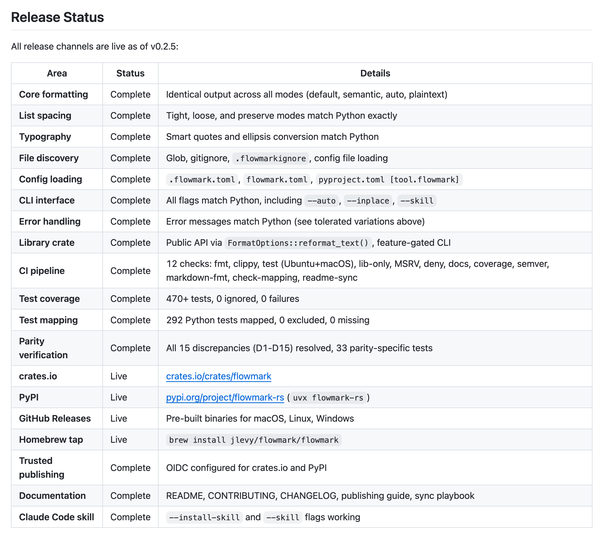
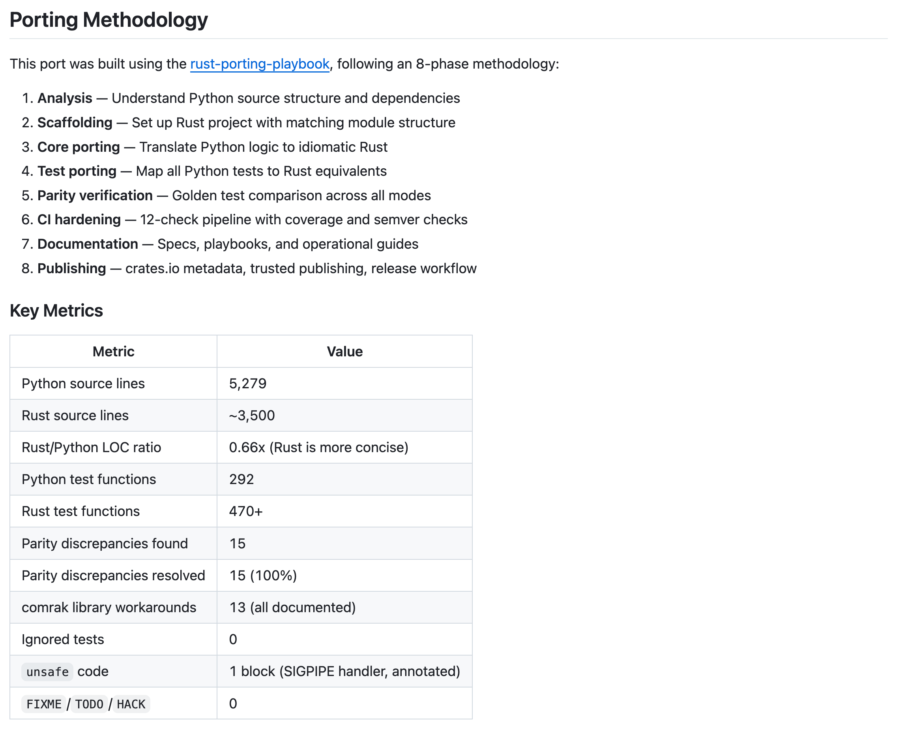
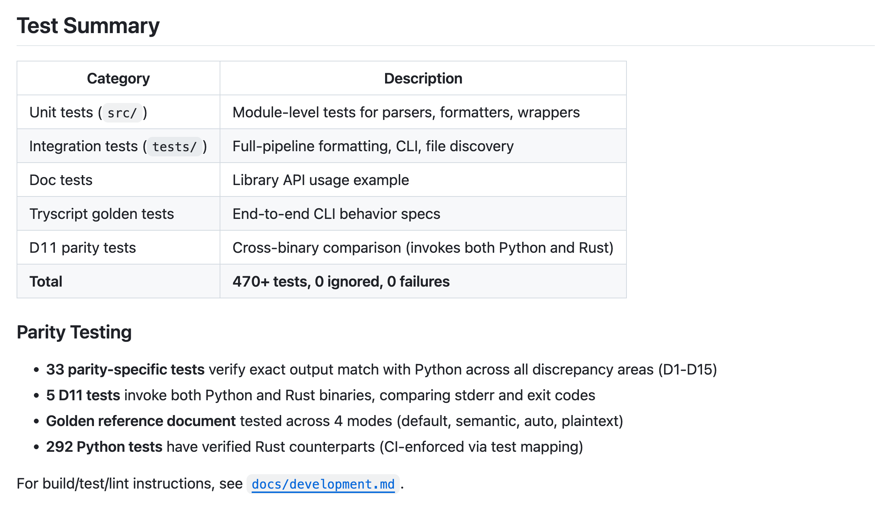

# Self-Improving, 100% Agentic Porting of Python to Rust

I’m excited to share something new: a self-improving, automated system for porting
Python codebases to Rust.

After a few weeks of experimentation, I’m open sourcing the **rust-porting-playbook**,
including ~200 pages of agent guidelines and process docs and all code for a case study
of porting, **flowmark-rs**, a fully agent-written port of the Python Flowmark Markdown
auto-formatter.

I’m also releasing two useful supporting tools, **tbd**, an improved Beads-style agent
issue tracker written in TypeScript, and **tryscript** a powerful testing framework for
CLI apps. (All repos are linked in replies.)

## How Hard is Porting Python to Rust?

Of course, anyone can ask a coding agent, “please port this to Rust.”
Easy parts will happen quickly—but then you hit harder parts.

Over the past few months, I’ve tried different models and approaches to a few CLI apps,
including Flowmark, as a baseline.
Until now, there was just too much friction, especially in messy details like
incompatible libraries.
For example, for Flowmark, the hard part was the dozens of subtle differences in the
Markdown parsing libraries in Rust (comrak) vs Python (marko).

But with the techniques I describe here and Opus 4.6 and GPT-5.3 Codex, I now think
automated porting is quite possible for many projects.
Especially for CLI apps, a few hours agent work can give a usable, published
cross-platform binary tool with exact feature parity and 10x to 100x the speed of the
original Python.

Even better, via the same approach, changes made to the Python version can now flow
downstream to Rust with almost no human effort, so you have an auto-synced port.
The era of auto-ported multi-language software is here!

Critically, the agent-written testing is extensive and transparent, so it helps gives
more confidence that the port is high fidelity.

## What are the Caveats?

This is very new. I’ve only done it three times so far.
There are caveats:

- The source project does not need to have great test coverage initially, but it should
  be *amenable* to testing via “golden testing” (more on this below).

- It works best if there are roughly equivalent libraries in both ecosystems.
  Most common Python libraries (CLI parsing, HTTP, regex, serialization, async) map
  cleanly to mature Rust crates.
  But some areas of deep learning have notable gaps, e.g. Rust has PyTorch bindings
  (tch-rs) and native frameworks like Burn, but the surrounding ecosystem still is not
  fully covered in Rust.

- Although I’ve used Python for a very long time, so I’m not as confident of idiomatic
  Rust. I’d greatly appreciate thoughts from Rust experts on the results here.

Nonetheless I think this approach is interesting at because:

- Porting is hard. But the whole methodology is self-improving.
  Every time we use it and push past another tricky part, the playbook gets better.

- I’ve done this for Python to Rust but I expect to work well for TypeScript to Rust as
  well. (Trying this soon!)

- Even if you’re not porting code to Rust, the approach illustrates several novel
  techinques I’ve not seen elsewhere, and they can easily apply to other agent coding.

## Techniques for Auto-Porting

I’ll walk through what I’ve learned and how it all works here.
The key parts of this playbook are:

1. **Knowledge curation:** Assembling extensive, reusable, reliable background knowledge
   on best practices and pitfalls related to source and target languages, libraries, and
   tooling. Can’t an agent figure these things out itself?
   Of course, sometimes.
   But having pre-curated knowledge significantly raises the quality, reliability, and
   speed of porting. The rust-porting-playbook has ~200 pages of Rust best practices
   across its `guidelines/`, `references/`, `playbooks/`, and `case-studies/`
   directories.

2. **Golden testing:** An alternative to classic unit and integration testing that
   offers *transparency* and *readability* to both agents and humans.
   I’ve built **tryscript**, an agent-friendly CLI tool that lets agents write golden
   tests in plain Markdown for CLI-based apps (more on both below).

3. **Test backfilling:** Assuming a given Python project has good tests is not
   realistic. Very few projects have truly thorough test coverage.
   But once you have a golden testing methodology, it’s straightforward for an agent to
   backfill extensive golden tests and iterate until coverage is thorough.
   This could uncover bugs!

4. **Test mapping:** Meta-tests that systematically map and automate parity checks
   across the two implementations.
   The beauty of golden testing is that the tests across the ports are actually the
   same! So CLI tests written in tryscript’s Markdown format can be reused between Python
   and Rust.

5. **Codified principles:** Without explicit engineering principles in context, agents
   drift: silently reducing scope, skipping hard bugs, or “moving the goalposts” on
   tests. A principles doc fixes this.

6. **Task management:** Agents struggle to manage hundreds of sub-tasks on their own.
   Git-native issue tracking (beads) helps enormously (more below).

7. **Meta-process improvement:** The playbook improves itself through a structured case
   study feedback loop (more below).

The key point: with sufficient directions in the playbook, *the whole process itself can
be automated*, including the self-improvement process.

Let’s first look at the results, then I’ll walk through each technique.

## Results of Flowmark Rust Port

The flowmark-rs port was written entirely by Claude Opus 4.6, with a final pass on PRs
by GPT-5.3 Codex Extra High.

 *Release
published to crates.io with full CI passing.*


*Overview of the porting methodology and playbook structure.*

 *292 Python
tests mapped to 442 Rust tests, with 100% mapping coverage.*

Now let’s walk through each technique.

Keep in mind, *all* of this is explained to the agent via the playbook docs!
My job was not to tell it to do each of these things step by step, but to make sure the
playbook gives it the right structure to use each of these techniques itself.

## Knowledge Curation

Agents can figure out many things on their own, but pre-curated knowledge and guidelines
dramatically reduces slow web searches and common confusions that suck up tokens and
waste context.

Agents use these 19 docs (~190 pages) before and during the port:

- **Guidelines** (7 docs, ~60 pages) are compact rules: porting principles and
  anti-patterns (the “north star” demanding *exact parity* and *forbidding* things like
  changing scope or skipping tests), test coverage requirements, and acceptance
  criteria.

- **References** (5 docs, ~70 pages) are lookup tables and pattern catalogs: an
  exhaustive Python-to-Rust construct mapping (types, collections, error handling,
  async), CLI app patterns (clap, tracing, error handling), cross-language test mapping
  with CI enforcement, and distribution best practices.

- **Playbooks** (4 playbooks + 3 templates, ~60 pages) are step-by-step process guides
  and checklists for the end-to-end port. A key insight: ~50% of effort goes to library
  workarounds and cross-validation, not the initial implementation.

## Golden Testing

**Golden testing** is one of the most neglected yet powerful types of testing.
The idea is to capture the behavior of a program—actual inputs, outputs, and
intermediate states—serialize it to a readable file, save that session trace, and diff
it later.

For some reason, golden testing is not appreciated by many engineers.
Perhaps it’s because we haven’t had a good name for it.
Sometimes it is called “snapshot testing” or “characterization testing,” but I find
“golden testing” a more descriptive phrase, since are capturing a wide range of
meaningful detail in a golden session trace, which is more than snapshotting or
characterizing inputs and outputs.

Golden testing gives situational awareness around code changes without the maintenance
burden of writing unit or integration tests specifically targeting each line or
function.

I think this is now more relevant than ever now for agentic coding for multiple reasons:

Unit, integration, and even end-to-end tests tend to verify *narrow expectations*. In
contrast, golden tests *contextually reveal broad state*, confirming expected results
while simultaneously making unexpected changes obvious.
When you modify one thing and something else unexpectedly changes, a diff on what
changed in the captured session reveals it immediately in a contextual,
easy-to-interpret way.

Golden testing can be done for many kinds of code and even UIs and web applications, if
you define an appropriate clean and diff-able serialization for sessions.
But for CLI tools, it’s especially easy to do!

I’ve also open sourced **tryscript**, a new tool specifically for CLI golden testing.
It runs shell commands from Markdown files, captures output in the Markdown document,
and diffs subsequent runs against expected results:

````markdown
### Wrap long lines

Let's see how narrow wrap widths work!

```console
$ echo "This is a paragraph that has been wrapped so that it reads well in a terminal or diff view." | flowmark --width 40 -
This is a paragraph that has been
wrapped so that it reads well in a
terminal or diff view.
? 0
```
````

Each test block has a heading, a command, the expected output, and the exit code
(`? 0`). Tryscript supports regex patterns for normalizing timestamps and IDs
(`[PATTERN]`), line elisions (`...` for zero or more lines, `[..]` for any text on a
single line), sandbox isolation, setup blocks, and environment variables, all in plain
Markdown that humans and agents can both understand readily.

This design is ideal for agent testing and porting:

1. **Tests are the spec.** You can have agents write specs and review the actual
   behavior exhaustively.

2. **Tests show behavior, not intent.** Unit tests usually verify a developer (or
   agent’s) expectations.
   Golden tests capture the actual input and output.

3. **Shared tests across languages.** The tests are simply tryscript-format Markdown so
   are the same for both source and target language.

4. **Agents are great at creating and understanding golden tests.** Writing golden tests
   is mechanical: an agent runs the test in “update” mode, which records the outputs,
   reviews and checks in the result.
   An agent can generate hundreds of golden tests, review them, commit.

5. **Humans can read golden tests.** Reviewing a golden test is much easier than a long
   code file with integration tests.
   The behavior is shown in context of a real run.

In the Flowmark case study, golden testing caught many bugs that unit tests would have
missed, such as mode-specific parity issues and systematic differences between the
Python parser (marko) and Rust parser (comrak).

## Test Backfilling

Most real-world projects don’t have thorough test coverage.
But with a golden testing framework like tryscript, backfilling coverage is
straightforward: an agent runs the tool against a wide variety of inputs, records the
outputs, and reviews and commits the results.
This can be done quickly and systematically before porting begins, giving the Rust
implementation a precise spec to match against.
The playbook’s **python-to-rust-test-coverage-playbook.md** documents this process in
detail.

## Test Mapping

Test count alone is misleading.
A Rust port can have 400+ tests while still missing coverage for critical Python
behaviors.

Test mapping solves this by creating a formal, traceable link from every Python test to
its Rust equivalent(s). In the playbook, this is a YAML manifest:

```yaml
- python_file: tests/test_alerts.py
  python_function: test_alert_after_heading
  status: mapped
  rust_file: tests/test_alerts.rs
  rust_function: test_alert_after_heading
```

Every Python test gets a status: `mapped` (has a Rust equivalent), `partial` (one Python
test split into multiple Rust tests), `excluded` (intentionally not ported, with a
documented reason), or `missing` (not yet ported).

The process has three parts:

1. **Discovery:** Auto-scan Python tests (via AST parsing) and Rust tests (via
   `cargo test --list`) to generate inventories of all tests on both sides.

2. **Mapping:** Link each Python test to its Rust counterpart(s). If a single Python
   test with many assertions becomes multiple focused Rust tests, the mapping tracks all
   of them explicitly.

3. **Meta-test in CI:** A validation check runs on every push, confirming the mapping is
   complete: no unmapped Python tests, no dangling references.
   This prevents silent coverage drift as the port evolves.

Golden tests (tryscript files) are shared directly between the two implementations, so
they don’t need additional mapping.
The mapping tracks unit and integration tests, where the Python and Rust implementations
naturally diverge in structure.

In the flowmark port, this produced 292 Python tests mapped to 442 Rust tests, with 100%
mapping coverage enforced in CI.

## Codified Principles

A pitfall I found when trying earlier versions of the porting playbook was that the
tests would be correct, and the mapping correct, but then during the implementation
process, Claude Opus would “move the goalposts.”
It might change the scope of the porting spec, state something was impossible, or
quietly skip some tests.

The fix was a short document codifying **engineering principles and anti-patterns** for
the porting process.
Having these explicitly in the agent’s context meant it would constantly remember its
job was **exact parity**, not “close enough.”

Putting principles and anti-patterns in the same doc works well: the principles say what
to do, and the anti-patterns give concrete examples of what *not* to do.
Agents respond well to both positive and negative examples: just saying “ensure exact
parity” is less effective than also specifying “do NOT disable a failing test.”
These are in **porting-principles-and-antipatterns.md** in the playbook repo.

## Task Management

Agents can handle a handful of ad-hoc tasks, but longer spec-driven development and
porting requires tracking many steps.
Usual to-do lists are good for a few tasks but not for dozens or more.
Agents lose track, repeat work, or silently drop tasks between sessions.

Agent-friendly issue tracking solves this.
**Beads**, created by Steve Yegge, are a remarkably effective way to scale an agent’s
capacity from ~5-10 ad-hoc tasks to hundreds of structured, trackable issues that
persist across sessions in Git.

I recommend **tbd** (“To Be Done”), my own TypeScript port of Beads that I find is more
reliable.
It uses simple Markdown for each bead, which avoids many of the merge conflicts
and complexity of Beads’ JSONL format.
It also includes CLI commands for spec-driven planning, knowledge injection (engineering
guidelines agents can load on demand), and shortcuts (reusable instructions for code
review, PR creation, commits).

With beads, you can leave an agent running for hours.
Both Beads and tbd are open source (links at the end of this post).

## Meta-Process Improvement

Every port conducted using the playbook is a **case study**, and every case study
generates observations that flow back into the playbook.

This is documented in **meta-improving-this-playbook.md** in the `_meta/` directory.

As the final phase of the playbook, an agent reviews the case study and triages
observations into categories: `FIX` (factual error), `ADD` (missing guidance), `CLARIFY`
(ambiguous), `GENERALIZE` (too project-specific), or `VALIDATE` (confirmed correct).

There’s a long way to go to make this work for more complex applications.
But I’ve gone through it about 3 times and it’s improving.

* * *

This is all an evolving process.
Even if you’re not porting a whole program, I hope some of these techniques are useful.
Let me know what you think and what works for you!

Josh

## Links

The rust-porting-playbook itself — ~200 pages of guidelines, references, playbooks, and
case studies for automated Python-to-Rust porting.
https://github.com/jlevy/rust-porting-playbook

A case study: flowmark-rs, the auto-ported Rust version of the Flowmark Markdown
formatter. Zero hand-written code, ~50x faster than the Python original.
https://github.com/jlevy/flowmark-rs

tryscript, a new golden testing CLI tool.
Write CLI tests as plain Markdown, share them across languages.
https://github.com/jlevy/tryscript

tbd ("To Be Done"), a new, agent-friendly issue tracker I use for task management.
Git-native, Markdown-based alternative to Beads.
https://github.com/jlevy/tbd

And Steve Yegge’s Beads, the original agent-friendly issue tracker that inspired tbd:
https://github.com/steveyegge/beads
